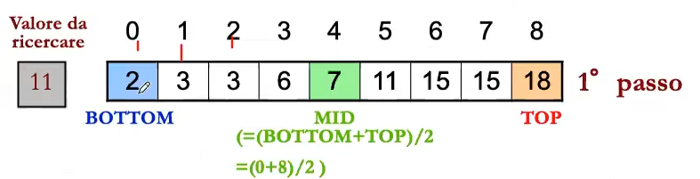
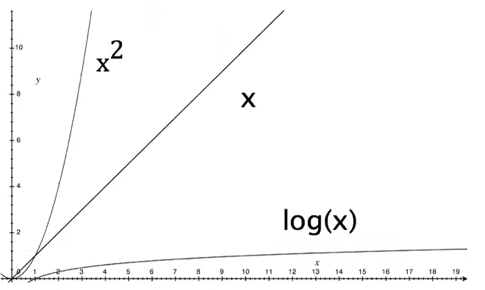

# Lezione 26/11/2020

Implementazione del concetto di coda con l'**Array**

viene da se la staticità della struttura alloccata. In più vedremo il concetto di buffer/array circolare, che deriva da come vengono gestiti gli indici. In particolare da come viene calcolato l'elemento successivo:

```c++
i = (i+1); // incremento normale in una coda di array
i = (i+1) % CodaSize; // se i+1 < CodaSize continua, se (i+1) > CodaSize i si annulla.
// i = Codasize-1 sarà l'ultimo elemento dell'array
// i = Codasize +1 Sarà il primo elemento dell'array
```

Prima di tutto:

* il front descrive l'indice di valore 0. Quando dobbiamo estrarre dalla coda usiamo questo indice.
* Rear indica il prossimo elemento. La coda è piena fino a rear-1

Coda **vuota** quando fronte == rear.

La coda è piena quando: 

```c++
(Rear+1) % CodaSize == Front
```

in questa implementazione io uso come *sentinella* ovvero come indice per indicare che la coda è piena. Questa implementazione quindi usa una colonna come sentinella. Di base quindi serve CodaSize+1 per inizializzare un array.


```c++
TipoElemento info;
struct queue{
    int CodaSize; // contiene al max CodaSize-1
    int Front;
    int Rear;
    TipoElemento *s;
};
typedef struct queue Queue;
typedef Queue *QueuePtr;
QueuPtr Q;

// Togliere dalla coda, incrementa di uno l'indice Front.

// Quando aggiungo in coda sta crescendo l'indice Rear.

bool QueueIsEmpty(Q);
bool QueueIsFull(Q);

void Enqueue(QueuePtr pt, ..);
void Dequeue(QueuePtr pt);

void QueuePrint(Q); // ricordarsi che è circolare, quindi devo usare il modulo

```


## Considerazione su ADT implementate:

com'è il costo di queste operazioni? Anche in questo caso il costo è costante, un numero che non dipende dalla lunghezza dell'array. 


### Operatore XOR (OR esclusivo)

il concetto è o uno o l'altro

| A    | B    | X    |
| ---- | ---- | ---- |
| 0    | 0    | 0    |
| 1    | 1    | 0    |
| 1    | 0    | 1    |
| 0    | 1    | 1    |

e ha proprietà associativa:

A ^ B ^ C = (A ^ B) ^ C = A ^ (B ^ C)

A ^ 0 = A : A ^ A = 0


Utile ad esempio per scambiare due variabili senza la variabile temporanea:

```c++
tmp = x;
x = y;
y = tmp;

// usando l'operatore XOR
// x == A; y == B;
x = x ^ y; // x == A ^ B, y == B
y = x ^ y;/* y == (A ^ B) ^ B
		  *   == A ^ (B ^ B)
           *  == A ^ 0 == A
           */
x = x ^ y; // x == (A ^ B) ^ A 
		  //   == (A ^ A) ^ B
// Alla fine delle 3 assegnazioni si ottiene lo scambio di variabili senza variabile tmp. Queste sono operazioni a livello di bit.
// Esercizio: fare una lista doppiamente concatenata senza il doppio puntatore.
```

# Algoritmi di Ricerca e Ordinamento:

Analisi dell'efficienza di un algoritmo e algoritmi sequenziali.


Con due algoritmi diversi, se l'algoritmo è più efficiente lo è sempre in base all'architettura. 

Ci sono classi di algoritmi che sono studiati da anni per renderli migliori. Ormai infatti esistono algoritmi per qualsiasi cosa.

##### Algoritmo di ricerca: (sequenziale e lineare)

permette di trovare  un elemento avente determinate caratteristiche. Gli elementi sono caratterizzati da una *chiave* e da *dati satellite*. L'idea è di trovare un oggetto di base, l'elemento chiave su cui poi si basa la ricerca. Gli altri diventano satellite.

Nella ricerca bisogna tener conto se si sta cercando un singolo elemento o se invece deve restituire tutti. Per questo bisogna stare attenti ad usare l'algoritmo corretto adeguato al comportamento che ci si aspetta.

#### Analisi Complessità:

Noi faremo analisi complessità sugli input. Quando analizziamo questo insieme, analizziamo tutti gli elementi che sono in ingresso su questo insieme. 

Se la dimensione dell'input è uguale, si cerca di avere un algoritmo che impieghi lo stesso tempo.

Noi vorremmo avere algoritmi in cui i tempi di esecuzione siano più bassi.


Legato a questo avremo 3 casi:

1. caso medio
2. caso peggiore
3. caso migliore


#### Ricerca sequenziale in un gruppo non ordinato. CASO PEGGIORE:

L'elemento cercato è in fondo

#### CASO MIGLIORE:

l'elemento cercato è il primo

Tra questi due antipodi compare tutto il resto compreso il **Caso Medio**

La ricerca sequenziale impostata per dare la prima chiave e quindi che si ferma la prima occorrenza della chiave allora la complessità cambia. Mentre invece se io dovessi trovarmi tutte le occorrenze io non ho nessuna garanzia che non ci siano altre occorrenze e quindi devo farmelo tutto in ogni caso (ci mette N volte).

è indifferente in questi archivi decidere se scorrere da destra a sinistra o da sinistra a destra. 

```c++
int SequentialSearch(char* item, int cout, char key){
    register int t;
    for (t=0; t<count; ++t){
        // questo algoritmo esce alla PRIMA occorrenza dell'elemento cercato
        if (key == item[t]) return t;
    }
    return -1; // nessuna occorrenza!
}

/* VARIANTE CON SENTINELLA (se ci arrivo sono alla fine)
 * faccio un array con N elementi in cui cercare e (N+1) = elemento cercato, facendo così posso fare la ricerca con un solo elemento.
 */
int SequentialSearchGuard(char* item, int count, char key){
    register int t;
    // Aggiorno il valore sentinella
    item[count] = key;
    // con una sola condizione verifico se sono alla fine o se ho trovato l'elemento
    // fa avanzare t finchè è uguale alla cella o se è vuoto
    for (t = 0; key != item[t]; ++t);
    if (t<count) return t; // found
    	else return -1;	  // not found
}
/* facendo la ricerca in questo modo ho ridotto le condizioni che vengono controllate all'interno del ciclo. Ho quindi ottimizzato i confronti.
 * Ma quindi come siamo messi a grado di complessità dell'algoritmo? Avendo ridotto le condizioni abbiamo ridotto? 
 * Dal punto di vista numerico, si abbiamo ridotto le condizioni, ma l'algoritmo rimane sempre uguale dal punto di vista delle esecuzioni.
 
*/

```


## Complessità nella ricerca sequenziale:

Se non abbiamo delle assunzioni rispetto allo stato dell'input, quindi non sappiamo caratterizzarlo, nono sappiamo dove andarlo a prendere.

Se invece avessimo un archivio ordinato rispetto a qualcosa, ad esempio dal più grande al più piccolo, possiamo sapere qualcosa dello stato dell'input. Un altro algoritmo è quindi la *sequenza ordinata*.

Come cambia la ricerca sequenziale in un archivio ordinato, quindi confrontiamo partendo dall'indice più basso e confrontiamo in ordine crescente. Sappiamo poi che se il prossimo elemento è maggiore di quello che stavo cercando, allora ho finito le cose da cercare.

``` c++
int SequentialSearchSorted(char* item, int count, char key){
	register int t;
    t=0;
    while( (t<count) && (key>= item[t])){
        if (key == item[t]) return t;
        t++;
    }
    return -1;
}
```

Cambia rispetto a prima perché posso fermarmi subito sapendo gli elementi cercati siano finiti.

In questo caso, la complessità del caso peggiore è diversa dalla ricerca su archivio non ordinato? No, la complessità non cambia.

## Ricerca Binaria (ricerca dicotomica/binaria):

Necessita di un accesso casuale ai dati (la lista non va bene, quindi).

Se ci sono questi requisiti, si può sfruttare la ricerca dicotomica. Si cerca l'elemento in mezzo in un insieme ordinato, e in base a che elemento è il centro si va avanti a cercare o invece si torna indietro.

In questo caso si elimina metà dell'insieme ogni operazione.



Si da per scontato che l'insieme sia ordinato. 

* con BOTTOM e TOP presi come inizio e fine. L'indice a metà saranno questi due indici divisi a metà

  ```c++
  mid = (TOP + BOTTOM)/2;
  
  // confronto su questo elemento:
  if (mid == ElCercato) return OK;
  if (mid < ElCercato){
      // si sposta la ricerca nella metà superiore dell'insieme
      BOTTOM = (mid+1);
      TOP = TOP;
      mid = (TOP + BOTTOM)/2;
      if (mid < mid){
          ... // si continua in questo modo all'infinito (sotto scritta meglio questa funzione)
      }
  }
  // logicamente esiste anche il caso mid>ElCercato 
  if (mid > ElCercato){
      ...;
      TOP = (mid-1);
      ...; // tutto uguale il resto
  } // che esegue esattamente le stesse cose, prendendo però solo il sottoinsieme superiore.
  /* cosa succede se non esiste l'elemento
   * Arrivo a un caso in cui BOTTOM > TOP, in questo caso posso fermarmi perchè viene meno la definizione di BOTTOM e di TOP
  
  // La chiave di questa ricerca quindi sono gli indici e l'ordinamento dell'insieme.
  
  ```

Codice dell'algoritmo di ricerca binaria:

```c++
int BinarySearch(char* item, int count, char key){
	int bottom, top, mid;
    bottom = 0;
    top = count -1;
   	// creo un ciclo finché BOTTOM e TOP non si invertono
    while (bottom <= top){
        mid = (bottom+top)/2; // Mid è sempre l'elemento centrale per ogni ciclo
        if (key<item[mid]) top = mid-1; // se la cosa cercata è minore dell'elemento in mezzo, allora si prende il sottoinsieme sotto
        	else if(key>item[mid]) bottom = mid+1;
        // se la cosa cercata è maggiore del MID, allora si prende il sottoinsieme superiore
        else return mid; // FOUND
    }
    return -1; // Non trovato
}
```

*Qual'è la complessità della ricerca binaria/dicotomica:*
$$
O(log_2(n))
$$
Nel caso peggiore dobbiamo fare questo numero di operazioni per trovare l'elemento.

Questa inoltre è la prova che il logaritmo di ricerca dicotomica va meglio della ricerca sequenziale.

Si ricorda che la crescita logaritmica permette di avere un tempo di esecuzione che cresce molto lentamente nel tempo, rispetto ad altri.




## Analisi dei Tempi di Esecuzione:

$$
Tempo di Esecuzione = T(N)
$$

Dove si prende N la dimensione dei dati di ingresso, e assumiamo che si prenda il numero di istruzioni come dipendenza per il tempo di esecuzione. (Ovvero non consideriamo aspetti dinamici dell'esecuzione dell'algoritmo).

Queste funzioni, che appunto indicano il tempo di esecuzione, possono avere molti elementi che le compongono, che possono contare di più o di meno.

Es:
$$
T(N) = 1 + N + N^2 + log(N)
$$
In cui:

* 1 = Elemento costante
* N = Componente lineare
* N^2 = parte quadratica, nonché quella che cresce più velocemente

Spesso però non servono queste funzioni dirette, ma alcune funzioni che permettano di delimitare la crescita di una funzione. Per questo ci viene in aiuto la notazione *O* (anche chiamata BigO).

Questa notazione fornisce il limite superiore ad una funzione, anche delimitatamente in un intervallo.
$$
f(n) = O(g(n))
$$


Mentre un'altra funzione ci permette di ingabbiare questa funzione dal basso.
$$
f(n) = Ω(g(n))
$$
Unendo queste due funzioni, si ottiene una terza funzione che, dato che riesce a indicare i massimi punti che toccherà con *O*, e i minimi punti con *Ω*, allora la funzione che ne risulta sarà una stima della funzione stessa (ovvero f(n) si comporterà più o meno come g(n)).
$$
f(n) = Ɵ(g(n))
$$
Tutti questi ragionamenti, logicamente valgono in intervalli limitati.

## Ricapitolando: Come caratterizzare la complessità

* abbiamo il **caso peggiore/minore/medio** di T(n) a seconda dell'input.
* La notazione **O/Omega/Theta** che indica invece come la funzione si approssima.

Es:

* la T(n) di un'operazione *push()* su uno stack:
  $$
  Ɵ(1)
  $$
  ( Per quando male, andrà sempre uguale).

* Inserimento di un elemento in una coda FIFO in un array circolare: 
  $$
  Ɵ(1)
  $$

* Ricerca sequenziale in un array non ordinato, nel caso peggiore
  $$
  Ɵ(N)
  $$

* Ricerca sequenziale in un array non ordinato, caso medio:
  $$
  Ɵ(1)
  $$

