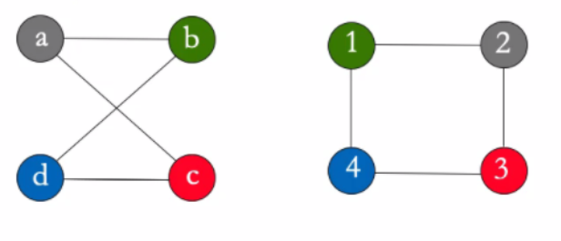

Giovanni Foletto - Primo anno ICE

# PROGRAMMAZIONE 1 - RICCARDI

## Lezioni teoriche

### 0.0) Obiettivi e Cos'è l'informatica:

​	**Obiettivo**: conoscenza di base dell'informatica.

​	**Informatica**: dal francese, informazione automatica. Termine coniato da Ph. Dreyfus nel 1962

​	Questo significa che è l'insieme degli aspetti scientifici e tecnici che sono specificatamente applicati alla raccolta e al trattamento dell'informazione, in particolare all'elaborazione automatica dei dai. Ma anche lo studio sistematico degli algoritmi che descrivono e trasformano l'informazione.

### 1.1) Algoritmi e linguaggi di programmazione:

Un **algoritmo** è una sequenza precisa di operazioni, comprensibili da un esecutore, che definisce una sequenza finita di passi che portano alla realizzazione di un compito (*task o problema*).

L'algoritmo ha alcune caratteristiche: (2 e 3 sono le più importanti)

1. deve essere **comprensibile** al suo esecutore (linguaggi di programmazione nel caso di un calcolatore). L'algoritmo così codificato viene chiamato *programma*.
2. deve essere **corretto ** (l'algoritmo ottiene la soluzione del compito cui è preposto, senza errori in nessun passo fondamentale).
3. deve essere **efficente** (l'algoritmo ottiene la soluzione usando la minor quantità di risorse).

DA NOTARE CHE: il concetto di algoritmo non è prerogativa dei calcolatori, ma semplicemente il calcolatore (in questo caso un computer) ha capacità di calcolo tali da gestire e lavorare con quantità di dati altrimenti intrattabili.

Gli algoritmi sono il modo in cui, implicitamente o esplicitamente, affrontiamo ogni problema nella vita di tutti i giorni. Questo problema viene chiamato **task**, e l'algoritmo serve a risolverlo.

Il problema dell'algoritmo della scelta invece crea un problema, il cosiddetto **il problema della segretaria**, che contiene una semplificazione matematica dell'algoritmo della scelta ottimale dal punto di vista matematico. 

Il concetto di questo problema è che dovendo scegliere di assumere una tra 100 segretarie, con l'unica remora che una volta assunta una, non si continua a cercare. L'algoritmo in questo caso direbbe di scegliere solo passati i primi 37% elementi (in questo caso segretarie), dopodichè, passato questo step, il primo che si dimostra all'altezza del compito anche in base alle persone viste in precedenza viene assunto e si chiude la ricerca.

(Vedi: https://www.smartworld.it/tecnologia/formula-matematica-decisioni-difficili-della-vita.html).

Dal concetto di ottimizzazione e rendimento dell'algoritmo si incontra anche il concetto di **reward**: ho due scelte, una usuale (**exploit**), un altra che cambia e esce dagli schemi (**explore**). La migliore dipende dal migliore risultato che le due rendono possibile.

##### 	Il grafo

Per la rappresentazione di alcuni logaritmi è molto utile l'utilizzo del **grafo**. Il grafo è uno schema che collega tra loro le informazioni possedute, ottenute anche fonti diverse. Le informazioni così raccolte hanno il lato positivo di essere facilmente ricercabile, distinguibile e visibile. Inoltre rende evidenti i collegamenti che hanno tra loro. 

Questo tipo di schematizzazione, essendo molto ottimizzata e mettendo subito in risalto le informazioni che hanno contatti tra di loro, vengono ampiamente  utilizzati nell'intelligenza artificiale, permettendo appunto grandi elaborazioni. Il grafo quindi è un oggetto logico molto potente.

Un accortezza: con questa struttura è facile prendere due grafi uguali come diversi. I grafi si dicono **isomorfi** se hanno le stesse caratteristiche in termini di nodi e archi.

A questo punto però si crea un problema, infatti in alcuni casi, usando un dato algoritmo ottengo risultati diversi se non qualifico un qualche tipo di **parametro**. Proprio il concetto di parametro (inteso nel senso informatico, cioè elemento che caratterizza un determinato algoritmo e  che l'algoritmo si aspetta per eseguire un compito). I parametri quindi possono **condizionare l'esecuzione del task**.

##### 	Come descrivere un algoritmo:

L'algoritmo per definizione è una sequenza precisa di passi, di conseguenza una lista non ordinata di elementi non è l'oggetto giusto per la sua rappresentazione. Inoltre il fatto che attraverso un parametro si possa ottenere un risultato diverso rende la sua codifica difficile. 

Innanzitutto è essenziale che sia descritto come un programma, cioè come una sequenza di istruzioni scritte in un linguaggio comprensibile al calcolatore. Il compito del programmatore è proprio quello di scrivere del codice che porti alla soluzione ottimale del problema. 

Per iniziare bisogna inizialmente **definire esattamente il problema**, che può essere:

1. problema di **puro calcolo e conversione**, cioè risolvibile attraverso conoscenze matematiche.
2. problemi di **decisione**, cioè capire se una certa proprietà è propria di un certo elemento. (es. 15467 è primo?).
3. problemi di **ricerca**, cioè trovare un elemento con determinate caratteristiche in un determinato insieme.

Il passaggio da definizione del problema a esecuzione del task poi passa da altri step, che sono necessari alla codifica e alla comprensione dei vari step:

1. Problema: linguaggio **Lp**, ovvero linguaggio naturale (per descrivere il problema).
2. Algoritmo: linguaggio **La**, ovvero lo pseudocodice (lascia meno incomprensione ma più difficile da leggere). 
3. Programma: linguaggio **Lt**, ovvero linguaggio macchina (es. C/C++).

Una volta eseguiti questi **macropassaggi** si può passare alla rifinitura del processo, attraverso dei **micro-algoritmi** (alcune volte il programma e l'algoritmo necessario al suo funzionamento sono così semplici da non necessitare la stesure di micro-algoritmi di supporto).

Su algoritmi molto complessi si può applicare la tecnica del **deconstruct**, ovvero decostruire il problema finché non si ottengono tanti problemi di facile soluzione.

Nel caso della stesura di un algoritmo si devono prendere in considerazione tutte le casistiche. Ad esempio se si scrive un algoritmo per cercare un libro bisogna anche tenere in considerazione la possibilità che questo libro non sia presente nell'indice della ricerca. Allo stesso modo non si può pensare di avere una differenza abissale di prestazioni se il libro è presente nella prima parte di indice o invece è in fondo. Ci sono di solito sempre più di un modo per risolvere problemi, quindi il problema principale diventa quello di trovare il modo più efficiente disponibile.

##### 	La programmazione e il linguaggio di programmazione

Programmare innanzitutto significa analizzare un problema, progettare un algoritmo per ottenere una soluzione, esprimere l'algoritmo in un linguaggio di programmazione, mettere la macchina nella situazione di eseguire il programma e infine correggere eventuali errori.

L'algoritmo deve essere tradotto da linguaggio formale e reso comprensibile all'esecutore. L'insieme dei comandi dati al calcolatore in un certo linguaggio viene chiamato **programma**.

Il linguaggio di programmazione deve essere **rigoroso e preciso** dal punto di vista di:

1. **sintassi**: le regole che descrivono le stringhe di parole riconosciute dal linguaggio.
2. **semantica**: regole per l'interpretazione delle stringhe e che descrivono i processi computazionali dell'esecutore (o più semplicemente un errore logico nella stesura del programma, cioè un errore nella comprensione logica del programma). Questo errore è più difficile da individuare perché il compilatore non dà errore, ma i risultati saranno incoerenti.

Parlando di linguaggi di programmazione, bisogna dire anche qualcosa sull'astrazione del linguaggio: 

1. se il linguaggio è di bassissimo livello, quindi troppo vicino alla macchina è difficile programmare.

2. se il linguaggio è troppo di alto livello, quindi molto vicino al linguaggio del programmatore, i programmi diventano inefficienti.

   

Agli albori dell'informatica si programmava in linguaggio macchina, cioè compreso direttamente dalla macchina. 

Dagli anni '50 iniziano a nascere i primi linguaggi di programmazione di alto livello, data la sempre più alta complessità dei programmi.

Ad oggi esistono tantissimi linguaggi di programmazione, ognuno con il suo scopo e inventato per esigenze diverse.

##### 		Metodo grafico per creare algoritmi:

Gli algoritmi possono essere schematizzati anche attraverso diagrammi di flusso, cioè blocchi orientati che hanno un significato proprio.

CARATTERISTICHE: 

- BLOCCO **INIZIO**: unico nodo del grafo da cui si può solo partire infatti  ha una sola freccia uscente. Rettangolo rosso per convenzione. Di solito si definisce con '1' l'inizio.
- BLOCCO **FINE**: blocco in cui si può solo arrivare infatti ha una sola freccia entrante. Rettangoli rossi per convenzione. Di solito si definisce con '0' la fine.
- BLOCCO **ISTRUZIONE**: 
  - **assegnazione**: dà il valore che c'è a sinistra alla variabile di destra.
  - **I/O**: (input/output), si sta leggendo o scrivendo
  - **controllo**: (con più uscite, in questo caso vero e falso) 

### 1.2) Architettura hardware di un compilatore:

##### 	Storia del Calcolatore:

Il primo calcolatore definito tale è ENIAC, creato nel 1945 in America con il principale scopo di calcolare la traiettoria dell'artiglieria. Poi donato al University of Pennsylvania, dove invece venne usato per il calcolo ingegneristico e scientifico. Pesava circa 27 tonnellate e per programmarlo erano necessarie diverse persone, infatti si basava su una *plugbboard* cioè un sistema di "prese" che, usate per fare il contatto giusto, fornivano risultati alle operazioni date come input. Non esisteva un linguaggio di programmazione pe questo computer e i cosiddetti "programmatori" dell'epoca probabilmente non lo hanno mai visto in tutta la loro vita, dato che loro facevano solo i calcoli per farlo funzionare e poi qualcun altro si occupava di creare i giusti collegamenti. La sua potenza di calcolo era tale da permettere di calcolare quello che un uomo avrebbe fatto in 20 ore in soli 30 secondi. Aveva un clock di circa 100kHz, e garantiva una vasta quantità di calcoli possibili.

Dopo la seconda guerra mondiale inizia effettivamente lo sviluppo di una macchina più vicina all'immaginari comune. Sempre più comuni diventano:

1. MAINFRAME: computer di grandi dimensioni ed elevata potenza, solitamente condiviso fra più persone/uffici.
2. PERSONAL COMPUTER: computer dotati di tastiera e schermo separati, di memoria di massa interni o esterni alla memoria centrale e molto più economico. 
3. LAPTOP: computer portatile, nonché evoluzione portabile del personal computer. Diventa molto famoso e utilizzato. Diventano così sofisticati che inizia il processo di miniaturizzazione dato che si poteva fare con le tecnologie disponibili ormai.
4. HANDHELD COMPUTER (SMARTPHONE): cellulari dotati di touchscreen, molto portabili e maneggevoli. Anche con questi come con i laptop avviene il processo di miniaturizzazione.
5. WHERABLE COMPUTER: sono computer così miniaturizzati da poter essere messi all'interno di un orologio, o un altro oggetto facilmente indossabile. Questi solamente sono caratterizzati da una gamma di sensori solitamente molto avanzati che possono servire per monitorare lo stato di salute o altri scopi.

La miniaturizzazione che è avvenuta è dovuta alla possibilità di dimezzare la grandezza del transistor per un certa quantità di volte, data dalla legge di Moore.

Moore infatti nel 1965 ipotizza che il numero di transistor inseribili nei microprocessori sarebbe raddoppiato ogni anno. La sua previsione si rivela corretta, finché verso la fine degli anni '80 viene riformulata: raddoppio del numero di transistori ogni 18 mesi. 

Per aumentare ancora più le prestazioni si cerca di aumentare il clock dei processori stessi. Il **clock** di un processore è il dato che indica la quantità di calcoli può fare al secondo. Al momento il dato del clock è pressoché fermo intorno al dato di 3gHz. Questo stop è dovuto al problema fisico per cui aumentando troppo il clock, il calore emesso diventa esponenzialmente maggiore. Di conseguenza quando si sono provati clock più alti si ha avuto problemi di gestione delle temperature eccessivamente alte. Per ovviare questo problema si apre un'altra strada: il multithreading o clock distribuito ad albero. Questo permette di passare il clock in tutte le parti del processore e rendere quindi i processi sincronizzati, utilizzando la potenza di tutte le parti assieme e quindi garantendo una maggior potenza.

##### 	Organizzare il software di un calcolatore

Il normale schema di un calcolatore è (generalmente) così costruito:

Per leggere questo schema bisogna capire che: 

1. Tutto si basa su quello che ha sotto di se e può comunicare solo con i blocchi a se adiacenti. (ad es. il software di sistema non si interfaccia direttamente con l'hardware, passa attraverso il sistema operativo).
2. L'unico che può operare con l'hardware è il sistema operativo. Questo ne gestisce tutte le componenti.

##### 	Architettura Hardware:

L'architettura hardware sopra è nota con il nome di **Macchina di Von Neumann** ed è così costituita:

1. **CPU** (central processing unit): svolge l'elaborazione eseguendo i programmi logici.
2. **MEMORIA CENTRALE **: memoria utilizzata per memorizzare dati e istruzioni, volatile (usata quindi solo per l'esecuzione di programmi).
3. **MEMORIA DI MASSA **: usata per memorizzare grandi quantità di dati e programmi in maniera persistente, al contrario della memoria centrale.
4. **PERIFERICHE**: sono di vario tipo e servono a tutto quello che permette l'interazione con il calcolatore. (ad es. tastiera, monitor, stampante, ..).
5. **BUS DI SISTEMA**: elemento che interconnette gli altri componenti consentendo lo scambio di dati, quindi anche il collegamento fra periferiche e hardware.

##### 	Macchina di Von Neumann:

###### CPU: unità di elaborazione

La CPU è l'unità di elaborazione del calcolatore, si occupa di caricare le istruzioni in memoria centrale, interpretarle e eseguirle.

E' altamente specializzata, perché è pensata per eseguire pochi tipi di operazioni ma molto velocemente. 

Il suo lavoro è scandito dal **clock** (orologio interno). La potenza del calcolatore dipende in parte dal clock, infatti quanto più questo è alto, tante più sono le istruzioni che riesce ad eseguire al secondo. La sua frequenza infatti viene misurata in Hz, e 1 Hz = 1 ciclo/s. Ad oggi le CPU riescono a lavorare in parallelo, il cosiddetto "lavoro condiviso", grazie al clock. Infatti il segnale del clock che arriva a tutti sincronizzato permette di eseguire azioni contemporaneamente.

###### Memoria centrale:

La memoria centrale è destinata a accogliere dati e programmi sui quali opera il calcolatore. (ad es. quando usiamo il computer qui vengono memorizzati i dati di programmi che stiamo usando, ...). La memoria centrale è velocissima ma volatile (cioè una volta che il programma finisce, tutti i dati di un programma vengono cancellati e lo spazio viene liberato). Questa memoria accoglie i dati necessari a far funzionare i programmi. Concettualmente è composta da una sequenza di celle ognuna delle quali contiene una parola (**word**). Ad ogni cella si può accedere direttamente specificandone l'**indirizzo**, e accedendone si può cambiare il suo contenuto (read/write). La quantità di bit da cui è composta la word dipende dalla macchina, infatti è caratteristico del microprocessore e attraverso questo si identifica lo spazio di indirizzamento. 

La memoria centrale solitamente è realizzata da una **RAM** (random access memory). La sua caratteristica è che ogni cosa è accessibile e non devo scansionare tutti gli indirizzi per cercare la cella che ho bisogno. (per es. non è come il nastro magnetico che devono fisicamente essere spostate avanti e indietro per trovare l'informazione cercata). Questo ha ricadute dirette sul tempo di accesso, che è indipendente dall'indirizzo della word che si vuole accedere. Questa è una memoria volatile quindi i dati presenti qui sopra si perdono quando si spegne la macchina. Esistono SRAM (static RAM), molto veloce, può contenere pochi dati acceduti molto frequentemente, e DRAM (dynamic RAM) che contiene più dati, ma più lentamente.

Altri tipi di memoria presenti sono le **ROM** (read-only memory). Hanno caratteristiche simile alle RAM, hanno un accesso veloce ai dati (ma non come quello delle RAM) e si tratta di **memorie permanenti** su cui però non si può scrivere. Tipicamente son utilizzate per memorizzare dati e programmi che servono prima del caricamento del Sistema Operativo (ad es. per il caricamento del BIOS = Basic Input-Output System).

La memoria quindi com'è fatta? Appare come una lista di word cioè un mattoncino composto da 16bit, di conseguenza posso memorizzare tanti dai quanti 2^16 valori binari. All'interno della memoria ci posso mettere tante word come gli indirizzi di memoria che sono 1024, e sono assegnati da 0 a 1023. Se questi fossero i limiti del tuo microprocessore allora devi fare in modo che all'interno di questo spazio di memoria ci stiano i dati e i programmi necessari al tuo scopo.

Per questo motivo in memoria non si può accedere a valori più grandi di 2^16 e non si può accedere all'indirizzo 1024.

Però poi a questa memoria si deve poter accedere, quindi nella CPU esistono dei registri, che sono word di memoria chiamate così per distinguerle da quelle in memoria centrale. Questi registri possono essere:

1. AR (Address Register): di almeno 10 bit, perché in questo caso posso indirizzare da 0 a 1023
2. DR (data Register): posto in cui i dati di cui la CPU ha bisogno per fare operazioni che vengono copiati in questa posizione dalla memoria centrale per rendere le informazioni direttamente disponibili alla CPU.

I registri sono elementi di supporto al calcolo.

###### Gerarchia di memoria

Ci sono a disposizione memorie con caratteristiche diverse in base al loro scopo:

1. Registri: presenti nella CPU, piccoli ma veloci, utili per contenere dati temporanei per le operazioni della CPU
2. Memoria cache (SRAM): veloce, contiene pochi dati usati/richiesti frequentemente
3. Memoria principale (DRAM): meno veloce ma contiene più dati
4. Memoria secondaria o di Massa: molti dati, indicativamente più lenti (anche se gli SSD consentono un vantaggio prestazionale rispetto agli HD o agli HHD).

###### Rappresentazione dell'informazione:

Tutti i dati vengono solitamente rappresentati in maniera **binaria**, ovvero il bit che può prendere il valore 0 o 1. Questo è molto utile perché si basano strutturalmente basati su dispositivi bistabili (corrente ON o corrente OFF). Per questo l'elaboratore elettronico può operare solo su sequenze di simboli binari. 

Il BIT (derivato da Bynary digIT) è quindi l'unità elementare dell'informazione. Comandi e dati nel computer vengono quindi rappresentati con lunghe sequenze di numeri binari.

Essendo tutto codificabile attraverso il bit, allora sono state inventate strutture per contenere la rappresentazione figurata della realtà. Ad esempio la convenzione ASCII, poi diventata extended-ASCII, ha codificato i caratteri come sequenza di 8bit, il **byte**.

Per i multipli del byte si adottano gli stessi simboli del sistema decimale, ma visto che gli elementi sono in base 2, il fattore di scala è leggermente diverso:

###### Funzionamento della CPU:

Innanzitutto bisogna dire che:

1. il trasferimento dei dati avviene con il bus di sistema.
2.  Le fasi di elaborazione si susseguono in modo sincrono rispetto all'orologio di sistema (clock).
3.  Durante ogni intervallo di tempo **l'unità di controllo** (che fa parte del processore) stabilisce la funzione da svolgere.
4. L'intera macchina opera in maniera sequenziale (però architetture più evolute prevedono l'esecuzione parallela delle istruzioni).

  

Come si vede dall'immagine la CPU ha a disposizione vari elementi:

1. i registri (PC, INTR, CIR, DR, AR, ...)
   * registro di stato della CPU (**SR**)(FLAG: C, Z, S, V), serve a far capire al compilatore lo stato delle periferiche e delle varie parti del compilatore stesso.
   * Il program counter (**PC**) indica gli indirizzi dove andare a prendere la prossima istruzione.
   * registro istruzioni (**INTR**) segnale lo stato di funzionamento delle periferiche.
2. unità di controllo: capacità di controllare quello che sta succedendo, in pratica manda segnali per impartire degli ordini, in particolare possono provenire da questa unità il segnale di prelievo, di decodifica e d'esecuzione dell'istruzione.
3. Unità ALO: oggetto che esegue le operazioni aritmetico-logiche.
4. si nota il BUS di SISTEMA, responsabile di collegarsi ai vari registri e alle varie periferiche. (sotto)

Il Ciclo base di funzionamento della CPU: (visione ad alto livello)

1. FETCH
   1. La CU manda un segnale affinché il PC sia spostato nel AR (cioè la prossima istruzione viene indicizzata).
   2. segnale controllo (read) alla memoria centrale posto all'indirizzo in AR.
   3. il dato letto viene messo a disposizione nel DR (registro dei dati).
   4. la CU manda il segnale di controllo affinché il contenuto di DR sia spostato nel CIR (registro istruzione corrente).
2.  INTERPRETAZIONE: le informazioni sul CIR vengono decodificate dalla CU.
3. ESECUZIONE: la CU genera una sequenza di segnali di controllo necessari a eseguire l'istruzione.
4. il PC viene incrementato per puntare alla prossima istruzione.

Durante l'esecuzione la CPU può eseguire 3 macro-tipologie di istruzioni:

1. Istruzioni aritmetiche.
2. istruzioni di controllo.
3. istruzione di trasferimento dei dati (sia registro-registro, sia memoria-memoria, sia memoria-registro, sia registro-memoria).

###### Il Bus di Sistema

Il bus di sistema è l'elemento che interconnette le varie periferiche e i vari elementi del calcolatore. In ogni istante il bus è dedicato al collegare due unità, una che trasmette e una che riceve. Il processore esegue il *bus mastering*, ovvero seleziona le connessioni da attivare e indica l'operazione da svolgere.  Il bus è suddiviso in tre insiemi di linee: *bus dati*, *bus indirizzi* e *linee di controllo* (quest'ultime trasportano informazioni relative alla modalità di trasferimento e alla temporizzazione). 

Il Bus di sistema ha l'organizzazione della comunicazione cosiddetta *master/slave*, ovvero ci sono parti (*slave*) che devono sempre ascoltarne altre (i *master*). Generalmente il master è l'elemento di controllo, nonché quello che manda i segnali di esecuzione.

###### Le periferiche: memorie di massa

Con il termine memoria di massa ci si riferisce a un dispositivo di memorizzazione permanente capace di contenere grosse quantità di dati.

Possono essere: fissi o rimovibili, ad accesso sequenziale o casuale, dispositivi in sola lettura(RO), in lettura scrittura (RW), o WORM (Write Once Read Many), dispositivi magnetici, ottici o magnetico-ottici.

1. HARD DISK

   Sfruttano le proprietà magnetiche di alcuni materiali (sostanze ferromagnetiche) di poter assumere a comando una certa direzione di magnetizzazione. A ciascuna direzione associa un simbolo binario. Sono costituiti da micro-celle magnetizzabili indipendentemente. La magnetizzazione è semipermanente, cioè rimane anche in assenza di mancanza di corrente ma può essere modificata.

2. MEMORIE DI MASSA: HDD

   Usa uno schema di memorizzazione creato in fase di formattazione di basso livello. Ogni superficie è divisa in tracce concentriche. I dati sono memorizzati in maniera sequenziale. Ogni traccia è divisa in settori. L'insieme delle tracce omologhe poste su diverse facce è detto cilindro.

3. SSD: MEMORIE ALLO STATO SOLIDI

   Accesso completamente elettronico (invece che elettromagnetico) ai dati. Al momento costi maggiori per unità di memoria. Permettono uno start-up immediato, latenza molto bassa e velocità di trasferimento circa un ordine di grandezza maggiore rispetto agli hard disk. 

4. RAID

   Per aumentare le prestazioni dei sistemi a disco è possibile raggruppare più dischi in un sistema RAID (Redundant Array of Inexpensive Disk). Questo sistema suddivide i file in blocchi registrati su dischi diversi per aumentare le prestazioni (data striping). Questo sistema è anche utilizzato per incrementare l'affidabilità dei sistemi a disco attraverso un meccanismo di ridondanza.

###### L'interfaccia delle Periferiche

Comunicare con le periferiche può essere complicato, infatti se si dovesse avere del codice per parlare con ogni singola periferica il lavoro del programmatore diventerebbe impossibile. Per questo esiste un'interfaccia, che fa come da traduttore tra il linguaggio della periferica e la macchina.

E' possibile avere un interfaccia diversa per ogni periferica, ma è più logico avere delle interfacce standard per periferiche simili. (Ad es. USB: Universal Serial Bus).

Questa interfaccia si occupa concettualmente della gestione e dello scambio di dati tra il processore e le periferiche. In generale contiene:

1. un registro dati della periferica
2. un registro di comando della periferica
3. un registro di stato (questo talvolta collegato al registro delle interruzioni del processore)

A seconda del processore e dei registri delle periferiche, le interfacce possono:

1. condividere lo spazio di indirizzi della memoria (memory mapped I/O)
2. adottare uno spazio di istruzioni/indirizzi distinti (port mapped I/O) 

Le periferiche attraverso le interfacce possono essere gestite con due metodi principalmente: 

1. POLLING: il processore invia sul bus il comando di lettura e si mette in attesa che il dato sia disponibile sul registro della periferica attraverso continui cicli. (PRO: facile implementazione e gestione; CONTRO: tiene sospeso il processore nel ciclo di attesa del dato).
2. INTERRUPT: il processore invia il comando di lettura alla periferica e poi continua le sue operazioni. Quando il dato è disponibile sul registro della periferica, la periferica stessa "solleva" un *interrupt*, un interruzione. Il processore così interrompe le sue operazioni, salva il proprio stato ed esegue una opportuna routine per la gestione delle interruzione (compito del sistema operativo). Questa routine serve a verificare la presenza del dato sulla periferica del dato e a iniziare il trasferimento nel registro interni al processore, fino ad arrivare in memoria. Alla fine dell'*interrupt* il processore ritorna alle sue operazioni normali. (PRO: lascia più libero il processore di operare; CONTRO: gestione, implementazione e controllo più complicati).

Tra le periferiche sono presenti anche i terminali, cioè qualunque dispositivo di puntamento (tastiera, mouse, video ...), e le stampanti.

### 1.3) Architettura software di un compilatore:

Con il termine *sistema operativo* intendiamo l'insieme di programmi che opera direttamente sulla macchina fisica, fornendo interfacce di alto livello e mascherandone le caratteristiche specifiche delle periferiche e del processore. Questo ad esempio è molto utile nella gestione delle periferiche, perché permette di fornire un metodo *consistente* delle periferiche, ovvero una modalità standard di interfacciarsi con le periferiche disponibili senza dover eseguire comandi di basso livello. Importante notare inoltre che il sistema operativo è l'unico elemento con accesso diretto alle risorse hardware, e si riesce ad accedervi in altro modo direttamente probabilmente abbiamo un problema.

Il sistema operativo è il modo che consente ai programmi di ottenere risorse dal calcolatore. La traduzione da programma a calcolatore avviene ad alto livello, in modo che non si debba scontrarsi con la gestione degli indirizzi o dei registri. Il sistema operativo quindi, dovendo gestire tutte le funzionalità di basso livello attraverso dei controlli di alto livello, opera un alto livello di astrazione del linguaggio macchina.

#### 	Storia dei sistemi operativi:

Nel 1982 Kernigham introduce Unix, prodotto dai laboratori AT&T, che al tempo avevano grandi esigenze di un ecosistema stabile e uguale su cui sviluppare applicazioni. Caratteristica principale: poteva servire più utenti contemporaneamente, usando il multitasking. Tutti gli utenti infatti hanno un ordine di esecuzione al processore, ma sono tutti nell'ordine del proprio utente. Da Unix poi si svilupperanno tutti i sistemi operativi che tuttora conosciamo (Come MS-DOS o Linux).

Architettura di un SO, che ad oggi è organizzato secondo un architettura a *strati* (anche detta *onion skin architecture*). Ogni strato fornisce un astrazione dello strato sui cui si appoggia e permette una chiara separazione tra interfaccia e implementazione delle diverse funzionalità, oltre che a fornire l'insieme di programmi e librerie.

Il *kernel* del sistema operativo, ovvero il cuore dell'OS si occupa di:

- gestione periferiche (I/O informazioni)
- gestione memoria (Fornisce/non fornisce al memoria in base al carico del momento, stabilisce il tipo di memoria da fornire)
- gestione dei processi

Un processo è un entità dinamica, contrariamente al programma, infatti viene causato dal codice in esecuzione (*programma*) e dal suo stato di esecuzione (es. valore delle sue variabili).

Un processo è quindi un insieme di due elementi:

- E: il codice eseguibile del programma (questo fa partire il fetch per creare un processo)
- S: lo stato del processo

Logicamente il processo non viene gestito direttamente dal processore reale, se no verrebbe meno il concetto di multitasking. Il processore crea dei processori virtuali che si comportano similmente e che possono essere assegnati a un processo.

Nel processore è possibile che ci sia un solo processo in esecuzione in ogni istante, mentre gli altri processi sono pronti o in attesa. Ad ogni processo viene assegnato un valore massimo di tempo di esecuzione, scaduto tale viene revocato il processore virtuale e assegnato a un altro processo. Questa tecnica è detta di time-sharing, viene eseguito dal nucleo che decide da quali processi devono andare in esecuzione determinando lo *scheduling*, che è sequenziale. La soluzione tipica per la gestione del tempo di esecuzione di processi è a turno (*round-robin*, tutti i processi in questo hanno la stessa priorità ad essere eseguiti, nella realtà non funziona perché alcuni processi hanno la priorità). La CPU viene rilasciata anche quando un processo sta aspettando un I/O da/verso una periferica.

x

In questa complicata gestione delle risorse prende parte anche la gestione della memoria, che pensa al partizionamento della memoria tra i vari processi che la richiedono garantendo la protezione/separazione fra le diverse zone allocate. Il gestore memoria gestisce anche la memoria che va assegnata ai processi, e quando i processi finisco la memoria fisica si occupa di creare una memoria virtuale (più lenta di solito, chiamata SWAP o semplicemente memoria virtuale) e assegnare quella memoria.

## THE C PROGRAMMING LANGUAGE:

Ci sono principalmente 3 tipi di programmazione:

* programmazione per HARDWARE, ovvero la programmazione di dispositivi fisico/logici il cui il linguaggio di programmazione coincide con il linguaggio macchina. 
* programmazione per FIRMWARE, ovvero la programmazione che usa un'insieme comune di istruzioni mediante assembly, ovvero linguaggio di programmazione molto basso
* programmazione per SOFTWARE, ovvero programmare in un linguaggio intermedio che simula le funzionalità della macchina fisica, che per questo permette maggiore flessibilità (nel senso che posso realizzare un gran numero di programmi diversi e con funzioni diverse), ma che ha un utilizzo delle risorse meno efficiente.

Il sistema operativo prende parte molto nell'ultimo caso, infatti è suo il compito di fornirci le periferiche necessarie a fornire la traduzione da linguaggio macchina (che usano ad esempio nella programmazione firmware) e il codice. L'OS si occupa anche dell'astrazione degli oggetti e/o delle istruzioni complesse di alto livello.

### Diffusione dei linguaggi e Perché il C

Ci sono tantissimi linguaggi di programmazione creati o utilizzati per specifici utilizzi in cui sono molto apprezzati. Linguaggi più standard di medio-basso livello come il C o il C++ permettono una maggior comprensione del funzionamento della maggior parte degli altri linguaggi, che in alcuni casi forniscono astrazioni alle strutture di basso livello ancora presenti in questi.

Il C presenta una serie di elementi che lo rendono importante da imparare:

* permette l'allocazione dinamica e altri aspetti normalmente di alto livello, a un livello basso.
* gestione della memoria molto manuale
* linguaggio apprezzato/richiesto dalle aziende
* ha un astrazione che è posizionata tra il medio e il basso livello, motivo per cui è molto utile per ad. es. embedded system.

Il linguaggio C è stato creato nel 1972 da Kernighan e Ritchie ai Bell Tel. Labs. 